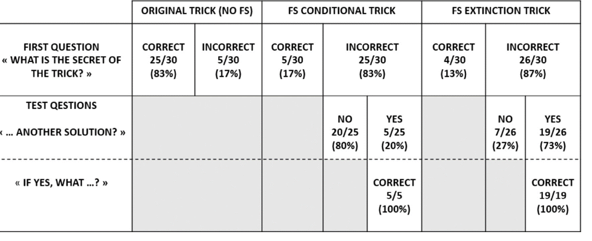

#### Article ID: leydV
#### Pilot: Gustav Nilsonne
#### Start date: 13/06/17
#### End date: 14/06/17
#### Co-Pilot: Mike Frank

-------

#### Methods summary: 
This paper investigated whether a single exposure to an unlikely false solution before the presentation of a card trick can prevent participants from finding the real (more obvious) solution, even if they were invited to search for an alternative solution. One group (original) was shown a card trick and asked for the solution. Another group (conditional) was shown the card trick and given a false solution, and then asked for the solution. They were then asked to think of an alternative solution, in case the one they reported was not correct. A third group (extinction) was given the false solution, asked for the solution, then received feedback that their solution was incorrect if they reported the false one. The outcome measure of interest was whether or not participants reported the correct solution.

------

#### Target outcomes: 
> Results from the first question of the original trick, without providing a false solution, show that 83% (25/30) of the participants found the correct solution (all the cards are the same), and none proposed the physical influence false solution. These results confirm that the correct solution of the trick is far more obvious than the physical influence false solution.

> As shown in Fig. 3a (see also Appendix A), there was a clear effect of the exposure to the false solution in the percentage of participants who discovered the correct solution after the first question. Results of chi-square tests showed that the percentage of participants who found the correct solution in the original trick group (83%) was significantly greater than both the percentage in the FS conditional trick group (17%, χ2 = 26.67, p < 0.001) and the percentage in the FS extinction trick group (13%, χ2 = 29.43, p < 0.001). Furthermore, for the two FS groups, participants who did not find the secret of the trick typically found solutions related to the false solution (e.g., “the card that the magician touched longer”). There is no significant difference between the percentage of participants who found the correct solution in the FS conditional trick group (17%) and the percentage in the FS extinction trick group (13%, χ2 = 0.13, p = 0.72).

> We next examined participants who did not initially solve the problem but then received the conditional or extinction test questions. Their results are shown in Fig. 3b (see also Appendix A). Results showed that the percentage of participants who found the correct solution in the conditional test question (20%) was significantly different from the percentage in the extinction test question (73%, χ2 = 14.41, p < 0.001) (for each condition, all the participants who answered “yes” for the first part of the test question found the correct solution).

------

```{r global_options, include=FALSE}
knitr::opts_chunk$set(echo=TRUE, warning=FALSE, message=FALSE)
```

## Step 1: Load packages


```{r}
library(tidyverse) # for data munging
library(knitr) # for kable table formating
library(haven) # import and export 'SPSS', 'Stata' and 'SAS' Files
library(readxl) # import excel files
library(CODreports) # custom report functions
```

## Step 2: Load data

Data were supplied as a Microsoft Word files containing tables. I have copied the columns containing the outcome variable into a comma-separated file.

```{r}
data <- read.csv("data/data.csv")
```

## Step 4: Run analysis

### Descriptive statistics
> Results from the first question of the original trick, without providing a false solution, show that 83% (25/30) of the participants found the correct solution

```{r}
correct <- sum(data$firstquestion_original)
total <- length(data$firstquestion_original)
percentage <- 100 * correct/total

compareValues(83, percentage)
compareValues(25, correct)
compareValues(30, total)
```

> We next examined participants who did not initially solve the problem but then received the conditional or extinction test questions. Their results are shown in Fig. 3b (see also Appendix A).

```{r, results = 'asis'}
table_out <- data.frame("Orig1" = c(paste(sum(data$firstquestion_original), "/", length(data$firstquestion_original), " ", round(100*sum(data$firstquestion_original)/length(data$firstquestion_original), 0), "%", sep = ""), NA, NA),
                        "Orig2" = c(paste(length(data$firstquestion_original) - sum(data$firstquestion_original), "/", length(data$firstquestion_original), " ", round(100*(length(data$firstquestion_original) - sum(data$firstquestion_original))/length(data$firstquestion_original), 0), "%", sep = ""), NA, NA),
                        "Cond1" = c(paste(sum(data$firstquestion_conditional), "/", length(data$firstquestion_conditional), " ", round(100*sum(data$firstquestion_conditional)/length(data$firstquestion_conditional), 0), "%", sep = ""), NA, NA),
                        "Cond2" = c(paste(length(data$firstquestion_conditional) - sum(data$firstquestion_conditional), "/", length(data$firstquestion_conditional), " ", round(100*(length(data$firstquestion_conditional) - sum(data$firstquestion_conditional))/length(data$firstquestion_conditional), 0), "%", sep = ""),                                         paste(table(data$testquestionfirst_conditional)[1], "/", sum(!is.na(data$testquestionfirst_conditional)), " ", round(100*table(data$testquestionfirst_conditional)[ 2]/sum(!is.na(data$testquestionfirst_conditional)), 0), "%", sep = ""), NA),
                        "Cond3" = c(NA, 
                                        paste(table(data$testquestionsecond_conditional)[2] , "/", sum(!is.na(data$testquestionsecond_conditional)) , " ", round(100*table(data$testquestionsecond_conditional)[2]/sum(!is.na(data$testquestionsecond_conditional)), 0), "%", sep = ""),
                                        paste(sum(data$testquestionsecond_conditional[data$testquestionfirst_conditional == 1], na.rm = T), "/", sum(!is.na(data$testquestionsecond_conditional[data$testquestionfirst_conditional == 1])), " ", round(100*sum(data$testquestionsecond_conditional[data$testquestionfirst_conditional == 1], na.rm = T)/sum(!is.na(data$testquestionsecond_conditional[data$testquestionfirst_conditional == 1])), 0), "%", sep = "")),
                        "Ext1" = c(paste(sum(data$firstquestion_extinction), "/", length(data$firstquestion_extinction), " ", round(100*sum(data$firstquestion_extinction)/length(data$firstquestion_extinction), 0), "%", sep = ""), NA, NA),
                        "Ext2" = c(paste(length(data$firstquestion_extinction) - sum(data$firstquestion_extinction), "/", length(data$firstquestion_extinction), " ", round(100*(length(data$firstquestion_extinction) - sum(data$firstquestion_extinction))/length(data$firstquestion_extinction), 0), "%", sep = ""),                                         paste(table(data$testquestionfirst_extinction)[1], "/", sum(!is.na(data$testquestionfirst_extinction)), " ", round(100*table(data$testquestionfirst_extinction)[ 2]/sum(!is.na(data$testquestionfirst_extinction)), 0), "%", sep = ""), NA),
                        "Ext3" = c(NA, 
                                        paste(table(data$testquestionsecond_extinction)[2] , "/", sum(!is.na(data$testquestionsecond_extinction)) , " ", round(100*table(data$testquestionsecond_extinction)[2]/sum(!is.na(data$testquestionsecond_extinction)), 0), "%", sep = ""),
                                        paste(sum(data$testquestionsecond_extinction[data$testquestionfirst_extinction == 1], na.rm = T), "/", sum(!is.na(data$testquestionsecond_extinction[data$testquestionfirst_extinction == 1])), " ", round(100*sum(data$testquestionsecond_extinction[data$testquestionfirst_extinction == 1], na.rm = T)/sum(!is.na(data$testquestionsecond_extinction[data$testquestionfirst_extinction == 1])), 0), "%", sep = "")))

rownames(table_out) <- c("First q", "Test q 1", "Test q 2")

kable(table_out, format = "markdown")

```



The table contains 36 numerical results. All of them MATCH, as determined by inspection. Three of them were already reported in the text and compared above. 

### Inferential statistics
> Results of chi-square tests showed that the percentage of participants who found the correct solution in the original trick group (83%) was significantly greater than both the percentage in the FS conditional trick group (17%, χ2 = 26.67, p < 0.001) and the percentage in the FS extinction trick group (13%, χ2 = 29.43, p < 0.001).

> There is no significant difference between the percentage of participants who found the correct solution in the FS conditional trick group (17%) and the percentage in the FS extinction trick group (13%, χ2 = 0.13, p = 0.72).

Percentages in the above text quotes are already covered in the descriptive analyses section above and will not be covered again here.

```{r}
# Test original versus conditional
table1 <- rbind(table(data$firstquestion_original), table(data$firstquestion_conditional))
test1 <- chisq.test(table1, correct = FALSE)

# Compare values for original versus conditional
compareValues(26.67, test1$statistic)
test1$p.value # For comparison by inspection

# Test original versus extinction
table2 <- rbind(table(data$firstquestion_original), table(data$firstquestion_extinction))
test2 <- chisq.test(table2, correct = FALSE)

# Compare values for original versus extinction
compareValues(29.43, test2$statistic)
test2$p.value # For comparison by inspection

# Test conditional versus extinction
table3 <- rbind(table(data$firstquestion_conditional), table(data$firstquestion_extinction))
test3 <- chisq.test(table3, correct = FALSE)

# Compare values for conditional versus extinction
compareValues(0.13, test3$statistic)
compareValues(0.72, test3$p.value, isP = T)
```
Where p-values were reported as inequalities, I compared them by inspection, resulting in MATCH for original vs conditional and MATCH for original vs extinction.

NB: No continuity correction was performed for the $\chi^2$ tests. 

> Results showed that the percentage of participants who found the correct solution in the conditional test question (20%) was significantly different from the percentage in the extinction test question (73%, χ2 = 14.41, p < 0.001) (for each condition, all the participants who answered “yes” for the first part of the test question found the correct solution).

```{r}
# Test conditional versus extinction
table4 <- rbind(table(data$testquestionfirst_conditional), table(data$testquestionfirst_extinction))
test4 <- chisq.test(table4, correct = FALSE)

# Compare values for conditional versus extinction
compareValues(14.41, test4$statistic)
test4$p.value # For comparison by inspection
```

The p-value was reported as an inequality, and I compared by inspection, resulting in MATCH.

## Step 5: Conclusion

```{r}
codReport(Report_Type = 'joint',
          Article_ID = 'leydV', 
          Insufficient_Information_Errors = 0,
          Decision_Errors = 0, 
          Major_Numerical_Errors = 0, 
          Minor_Numerical_Errors = 0, 
          Author_Assistance = FALSE)
```

All descriptive results matched. Results from chi-squared tests matched as well. 

```{r session_info, include=TRUE, echo=TRUE, results='markup'}
devtools::session_info()
```
